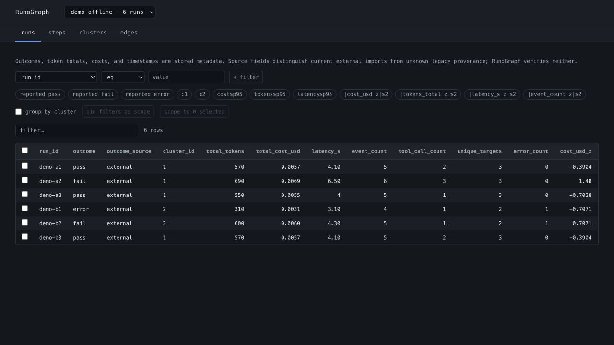

# RunoGraph Trace Workbench

RunoGraph Trace Workbench is a local, offline full-stack workbench for importing
and exploring execution traces from AI-assisted software work. It turns
caller-produced JSONL events into four inspectable tables: runs, route steps,
behavior clusters, and route edges. Its browser-based React UI and CSV export
use the same backend row builders.

`RunoGraph` remains the compact in-product brand; `Trace Workbench` names this
repository and its deliberately bounded passive-analysis component.

This repository is a pre-alpha prototype. It is intentionally scoped to
passive ingestion and analysis: it does **not** run agents, execute trace
content, sandbox commands, grade patches, or verify task outcomes.



The screenshot uses only the deterministic `demo-offline` fixture bundled with
the repository; it contains no production or customer trace data.

## Use cases

- Compare batches of agent runs within one experiment using caller-reported
  outcome, token, cost, and latency metadata.
- Inspect file, tool, and test-event sequences plus aggregate route
  transitions.
- Find behaviorally similar runs and outliers without using outcome labels as
  clustering features.
- Pin a filtered cohort in the URL and export the same scoped tables with a
  provenance manifest for further analysis.
- Keep potentially sensitive trace analysis local instead of sending run data
  to a hosted service.

## What the data means

Every run is imported from two local files:

- `events.jsonl` contains ordered trace events such as file reads, edits, tool
  calls, and test invocations. These are observations supplied by the trace
  producer; RunoGraph does not replay them.
- `meta.json` contains run metadata. `outcome` is a caller-provided label and
  must declare `"outcomeSource": "external"`. Token totals, elapsed time, and
  `totalCostUsd` are also supplied by the caller; RunoGraph does not calculate
  cost from a model price table.

Behavior clustering uses only event-level observations from `events.jsonl`.
Run-level outcome, token total, cost, and timestamp metadata are excluded from
the feature matrix and can appear only in tables or post-hoc summaries such as
reported pass/error rates and per-edge comparisons. See
[Architecture and data flow](docs/ARCHITECTURE.md).

## Quick start

The commands below document the local workflow for evaluators whose separate
written agreement with the copyright holder permits them to run the software.
Public repository visibility and this documentation do not grant execution
rights; see [License](#license).

Prerequisites:

- Python 3.12 (CI: 3.12.13)
- [uv](https://docs.astral.sh/uv/) (CI: 0.11.31)
- Node.js 24 LTS (CI: 24.20.0)
- pnpm 11.25.0 (the pinned package-manager version)

Install the locked dependencies:

```bash
pnpm install --frozen-lockfile
cd backend
uv sync --python 3.12.13 --extra dev --frozen
cd ..
```

Seed six deterministic synthetic traces with one command:

```bash
pnpm demo:seed
```

The seed writes an ignored local database at
`backend/.runograph-demo/runograph.sqlite`. Its outcomes and costs are
synthetic external metadata, not benchmark claims.
Re-running the command replaces only the `demo-offline` experiment so the
demo remains exactly six runs; use a different experiment ID for data you
want to preserve. The six `demo-a1`…`demo-b3` run IDs are reserved; seeding
stops without modifying the database if another experiment already uses one.

Start the backend and frontend in separate terminals:

```bash
pnpm demo:backend
```

```bash
pnpm dev
```

Open the Vite URL shown in the second terminal (normally
`http://127.0.0.1:5173`). Select `demo-offline` if it is not already selected.

## Import your own trace

The HTTP API is read-only. Import is an explicit local CLI operation:

```bash
cd backend
uv run --frozen python -m scripts.ingest_run /path/to/run \
  --db /path/to/runograph.sqlite
```

Minimal `meta.json` shape:

```json
{
  "runId": "run-001",
  "taskId": "task-001",
  "model": "producer-model-id",
  "startedAt": "2026-08-30T12:00:00Z",
  "endedAt": "2026-08-30T12:01:00Z",
  "outcome": "pass",
  "outcomeSource": "external",
  "totalTokens": 1200,
  "totalCostUsd": 0.04,
  "experimentId": "example"
}
```

`outcome` accepts `running`, `pass`, `fail`, or `error`. Those values describe
the producer's label; they do not certify correctness. Current `runId`,
`taskId`, and `experimentId` values must match
`[A-Za-z0-9][A-Za-z0-9._-]{0,127}` so URLs and comma-separated scopes have one
unambiguous representation; surrounding whitespace is rejected rather than
silently changing identity. All JSON timestamps must be ISO 8601 strings that
include an offset; numeric Unix epochs are rejected. Ingestion
normalizes them to UTC and rejects reversed run/event chronology. Terminal
runs require `endedAt`; a running trace may omit it, in which case latency is
unknown (`null`), never observed zero. Token/time/cost measurements are
required JSON numbers (not strings or booleans), finite, and non-negative.
Event details and the complete trust boundary are documented in
[Architecture and data flow](docs/ARCHITECTURE.md#ingest-contract).

Re-importing the same run ID is allowed only when its experiment and task
identity match. A collision with another experiment or task is rejected before
any stored rows are changed.

## Export

Export the four UI-equivalent tables plus a manifest:

```bash
cd backend
RUNOGRAPH_DB_PATH=/path/to/runograph.sqlite \
  uv run --frozen python -m scripts.export_runs \
  --experiment example --out /path/to/export
```

Filters use the same predicate grammar as the table API. For example,
`--filter outcome:in:fail,error` filters by stored outcome labels; inspect the
source field to distinguish current external imports from legacy provenance.
The `contains` operator is case-insensitive for ASCII letters only and leaves
non-ASCII code points exact, giving the Python and TypeScript evaluators the
same locale-independent result.
The pre-alpha predicate wire format has no escaping: `,` separates values and
`>` separates the two endpoints of `route.edge`. Stored free-text values that
contain those delimiters cannot currently be addressed by the affected
predicates; use a safe producer label or query the exported table instead.
Outcome-derived export fields use a `reported_` prefix, and cluster/edge rows
plus the manifest declare `outcome_label_source` as `external`, `unknown`,
`mixed`, or `none` so detached files retain their provenance. Current CLI
imports are `external`; rows migrated from a pre-provenance database are
conservatively `unknown` until re-imported from source traces.
String cells that could be interpreted as spreadsheet formulas are prefixed
with an apostrophe during export. Exported trace content is still untrusted;
review it before opening, sharing, or importing it into another system.
When `--out` is omitted, legacy or unsafe experiment names are mapped to a
sanitized, hash-suffixed directory below `~/.runograph/exports`; they are never
used as path components directly.

## Repository layout

```text
.
├── backend/
│   ├── runograph_backend/
│   │   ├── analysis/      behavior features, clustering, metrics, tables
│   │   ├── api/v1/        read-only FastAPI endpoints
│   │   └── storage/       validation, SQLite models, ingestion
│   ├── scripts/           local ingest, demo seed, CSV export
│   └── tests/
├── frontend/              React, TypeScript, Vite, Tailwind CSS
└── docs/                  architecture, evolution, CI policy, publication gates
```

## Project evolution

The current workbench is the result of a deliberate narrowing from an
agent-running, graph-heavy prototype to passive local trace analysis. The
[project evolution](docs/EVOLUTION.md) records the major pivots, the evidence
for each stage, and why the current boundary is intentionally smaller.

## Verification

The enforced backend gates are Ruff and pytest. Strict mypy is not currently
an enforced gate; the previous strict configuration was removed because the
existing codebase did not satisfy it. Type checking can be reintroduced only
with a green baseline and CI coverage.

```bash
cd backend
uv run --frozen ruff check .
uv run --frozen pytest -q
cd ..
pnpm --filter frontend test
pnpm --filter frontend typecheck
pnpm --filter frontend build
```

CI performs frozen installs with exact executable versions on `ubuntu-24.04`.
GitHub Actions use reviewed major tags under a read-only token and monthly
Dependabot review; see the explicit
[CI reproducibility policy](docs/CI_POLICY.md).

## Limitations and safety

- Treat imported traces as untrusted, potentially sensitive data. Review and
  redact filenames, summaries, task text, and metadata before import or export.
- Run the development API on loopback only. It has no authentication,
  authorization, multi-user isolation, or hardened production deployment.
- The importer validates shape but does not establish that events, token
  counts, costs, timestamps, or outcome labels are true.
- Default/new local storage directories are private (`0700`) and SQLite,
  WAL/SHM, CSV, and manifest files are `0600` on POSIX. An explicitly selected
  existing parent for `--db` keeps its directory mode, so inspect it before
  storing sensitive traces. The managed default demo directory is hardened to
  `0700` on every seed, including when it already exists. Non-POSIX systems use
  their native ACL model.
- The selected experiment and pinned scope live in the URL hash. Switching
  experiments clears incompatible filters/scope; malformed identifiers,
  predicates, or run lists produce a non-retryable invalid-URL state and no
  trace-table request. A filter or run scope without an explicit experiment is
  also invalid; only a bare unscoped view may select the first experiment.
- Clusters are exploratory similarities over a small hand-designed behavior
  vector. Full targets are lossless route identities, and cluster IDs,
  representatives, and tie-breaks are deterministic for a fixed run set. They
  are not quality scores or causal evidence.
- Startup applies one targeted compatibility update: databases from before
  outcome provenance was persisted get `outcome_source = unknown`. Re-import
  those traces to establish `external` provenance. There is no general
  migration framework or broader compatibility guarantee for older schemas;
  keep a backup before opening an existing database.
- Current ingestion rejects legacy identifier forms outside the safe grammar.
  Use the local export CLI (whose default path safely encodes legacy experiment
  names), then re-ingest under new IDs; do not assume unsafe legacy IDs are
  addressable through URL path or scope parameters. The UI disables
  selection-to-scope when a selected legacy run ID cannot round-trip safely.
- The bundled demo is synthetic. No production corpus or generated database is
  tracked in this repository.

## License

The source is proprietary commercial software and is **not open source**.
Viewing the repository does not grant permission to use, copy, modify,
publish, distribute, sublicense, or sell the software except under a separate
written commercial agreement. See [LICENSE](LICENSE) for the controlling
terms and the note about earlier, separately distributed CLI code.
