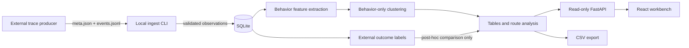

# Architecture and data flow

RunoGraph is a passive, local analysis pipeline. Code that launches an AI
model, exposes model-callable tools, runs model-generated shell, or grades a
repository is outside this repository's product scope.



The key separation is the split between behavior features and external
labels. Changing only a run's imported outcome must not change the normalized
feature matrix, cluster assignment, centroid distance, or representative run.
Regression tests enforce that invariant.

## Components

1. `scripts.ingest_run` reads one local run directory. There is no HTTP
   filesystem-ingest endpoint.
2. `storage.schemas` validates the wire shape. `storage.ingest` stores the
   supplied data and its provenance without replaying events or checking
   claims.
3. `analysis.route_graph` derives target sequences and transition counts.
   A node's machine identity is the complete target string; slugs or truncated
   labels are presentation concerns and never merge distinct targets.
4. `analysis.cluster` standardizes event-level trace features and applies
   deterministic k-means selection. Canonical run ordering, partition/`k`
   tie-breaks, cluster relabeling, and medoid selection make public cluster IDs
   invariant to database insertion order. Inputs come only from `events.jsonl`,
   not run-level metadata from `meta.json`.
5. `analysis.metrics` and `analysis.tables` combine trace-derived measurements
   with imported metadata. Pass/error rates and edge splits are post-hoc
   summaries of stored labels, accompanied by explicit provenance.
6. The read-only FastAPI service and CSV exporter share the same table
   builders. The React app consumes the API and has explicit loading, empty,
   error, and ready states.

## Ingest contract

Each run directory contains:

```text
run-directory/
├── meta.json
└── events.jsonl
```

`meta.json` fields:

| Field | Meaning |
| --- | --- |
| `runId` | Stable safe ID. Same experiment/task re-import replaces atomically; a cross-identity collision is rejected without mutation. |
| `taskId` | Safe caller-selected task identifier. |
| `model` | Producer-reported model or system identifier. |
| `startedAt`, `endedAt` | ISO 8601 JSON strings with offsets, normalized to UTC. Numeric Unix epochs are rejected. Terminal outcomes require `endedAt`; running latency may remain unknown. |
| `outcome` | External label: `running`, `pass`, `fail`, or `error`. |
| `outcomeSource` | Required literal `external`. |
| `totalTokens` | Required finite, non-negative caller-reported token total. |
| `totalCostUsd` | Required finite, non-negative caller-reported cost; never price-derived here. |
| `experimentId` | Required safe grouping identifier used by tables, UI, and exports. |
| `settingsHash` | Optional opaque producer settings identifier. |

`runId`, `taskId`, and `experimentId` use the public identifier grammar
`[A-Za-z0-9][A-Za-z0-9._-]{0,127}`. This excludes commas, slashes, empty IDs,
and traversal syntax; surrounding whitespace is rejected rather than silently
changing identity, so query, path, and hash scopes round-trip without an
escaping ambiguity. Legacy
databases may contain older forms: they remain
read-only data, their default export directory is sanitized plus hash-suffixed,
and producers should export then re-ingest under safe IDs.

Each JSONL event requires a non-empty ID, an offset-aware ISO 8601 timestamp
string (numeric Unix epochs are rejected), a supported
event type, and a `cost` object with finite non-negative JSON-number token/time
values. Numeric strings and booleans are rejected.
Events must be ordered by actual UTC instant, fall within the run interval, and
cannot cross reversed-offset/DST chronology. Target, summary, parent ID, and
optional 0..1 relevance score are producer observations.
The supported types are `file_read`, `file_edit`, `test_run`, `tool_call`,
`error`, `reflection`, and `final`. Their names describe captured events; they
do not cause RunoGraph to read, edit, test, or invoke a tool.

## Behavior-only feature boundary

The clustering vector is derived from observed event composition, run shape,
and per-event token/time observations. Run-level metadata—including
`outcome`, `totalTokens`, `totalCostUsd`, and timestamps—is absent. An observed
event whose type is `error` may be counted as trace behavior; that is distinct
from the terminal external `outcome` label.

External labels may be used after clustering to:

- filter rows;
- calculate reported pass/error rates within an already assigned cluster;
- compare reported labels across already derived route edges.

Those summaries describe the imported dataset. They do not validate task
correctness or establish that one behavior caused an outcome.
Machine-facing fields use `reported_` names, while cluster/edge table rows,
route graph responses, and export manifests declare their label source:
`external` for current validated imports, `unknown` for legacy provenance,
`mixed` when both occur in an aggregate, and `none` for an empty scope.

Outcome provenance is persisted alongside each run. On startup, the one
supported compatibility update adds that column to older databases and marks
all pre-existing rows `unknown`; it never infers that legacy labels came from
the current external ingest contract. Re-import from the original trace files
to establish `external`. RunoGraph has no general migration framework or
broader old-schema compatibility guarantee.

The compatibility step is versioned, transactional, and serialized within a
process; SQLite write locking plus bounded retry/reinspection covers concurrent
initializers. Demo reseeding similarly prevalidates all six bundles and applies
delete+insert in one transaction, so a failure preserves the prior demo.

## Trust and deployment boundary

- The application is offline-first and has no runtime dependency on an AI API
  or hosted font service.
- The API is read-only but unauthenticated. Bind it to loopback; do not expose
  it as a shared or public service without a separate security design.
- Trace content can contain confidential filenames, summaries, task text, or
  identifiers. Sanitize it before import and before sharing screenshots or
  exports.
- CSV export neutralizes leading spreadsheet-formula markers in string cells,
  but exported content remains untrusted and still requires review.
- On POSIX, managed/new storage directories use `0700`; SQLite, WAL, SHM, CSV,
  and manifest files use `0600` even under `umask 022`. An existing directory
  explicitly selected with `--db` retains its mode. The default demo directory
  is managed and is hardened to `0700` on every seed, even if it pre-exists.
  Non-POSIX ACLs are outside this numeric-mode contract.
- Pydantic validates structure, not truth. Imported outcomes, tokens, prices,
  timestamps, and descriptions retain the producer's trust level.
- The hash route carries the selected safe experiment ID and run scope.
  Experiment changes clear incompatible scope. The frontend mirrors backend
  column/operator/value validation and fails closed—without table requests—on
  malformed experiment, filter, scope, or run-list parameters.
- The pre-alpha predicate format is deliberately unescaped: comma is the value
  separator, and `>` separates `route.edge` endpoints. Free-text values that
  contain those characters remain storable but are not addressable by the
  affected predicates.
- SQLite files, exports, virtual environments, build output, dependency trees,
  and captured corpora are ignored and must not be committed.
